# 第 0 章 建構 SQL 執行環境
## 0-1 安裝 XAMPP 來建構 MySQL / MariaDB 資料庫
  - ### 安裝 XAMPP
    [下載 XAMPP](https://www.apachefriends.org/zh_tw/index.html)
    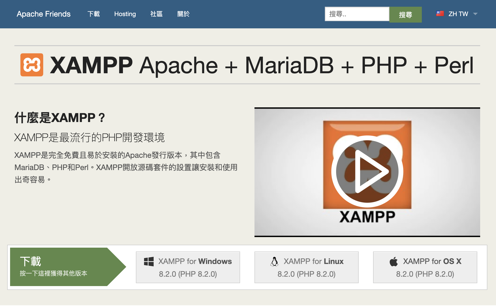

  - ### 設定 MySQL / MariaDB 管理員密碼
    安裝完成後，就可以啟動 XAMPP 控制台來開啟 MySQL / MariDB 資料庫了，MySQL / MariDB 伺服器內建有一個管理員帳號 root，
    但預設沒有密碼，此設定可透過 `phpMyAdmin` 提供的 Web 管理介面來設定。

    #### 以 Mac 為例：
    - 啟用資料庫
    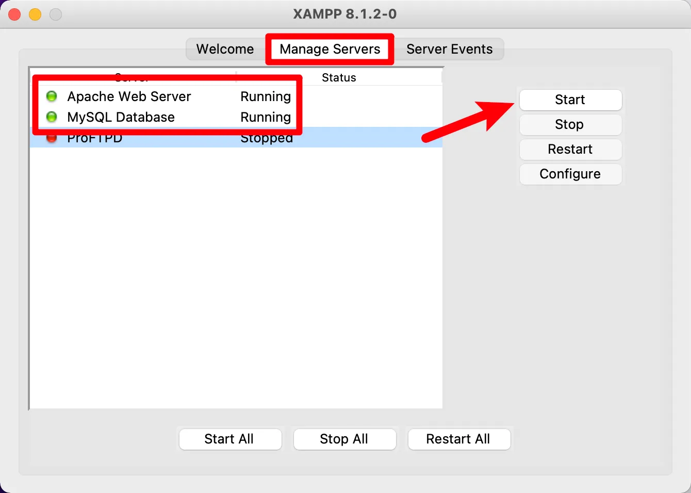

    - 開啟資料庫後台
    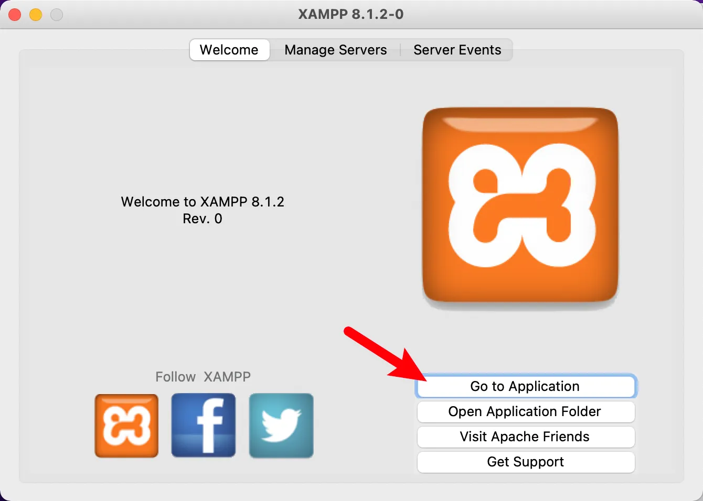

    - 點選畫面右上角的 `phpMyAdmin`，開啟資料庫後台
    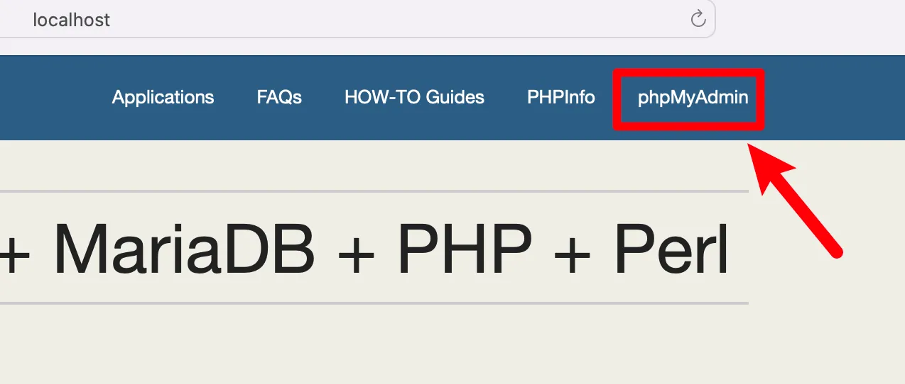

    - 建立新資料庫
    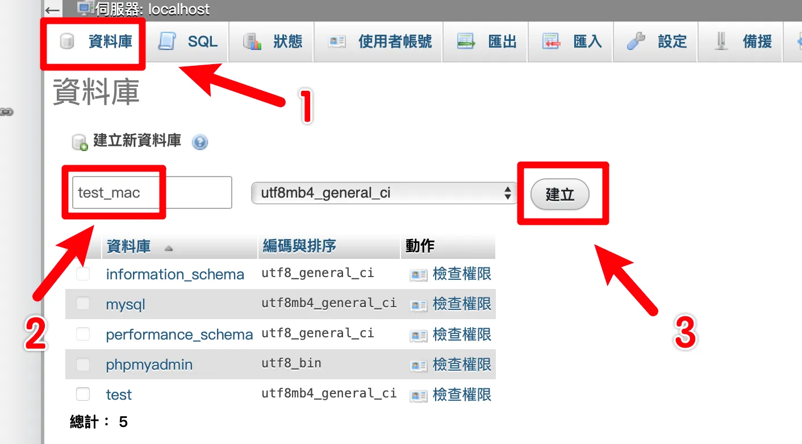

    - 點選 `使用者帳號`，找到 `root localhost` 並點選 `編輯權限`
    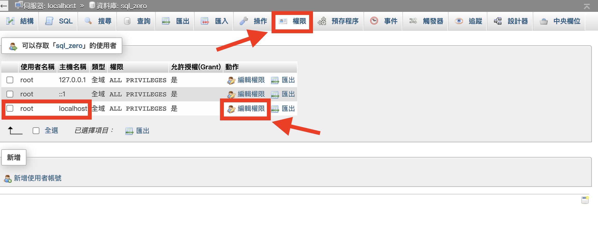

    - 設定 密碼，並點選 `執行` 儲存
    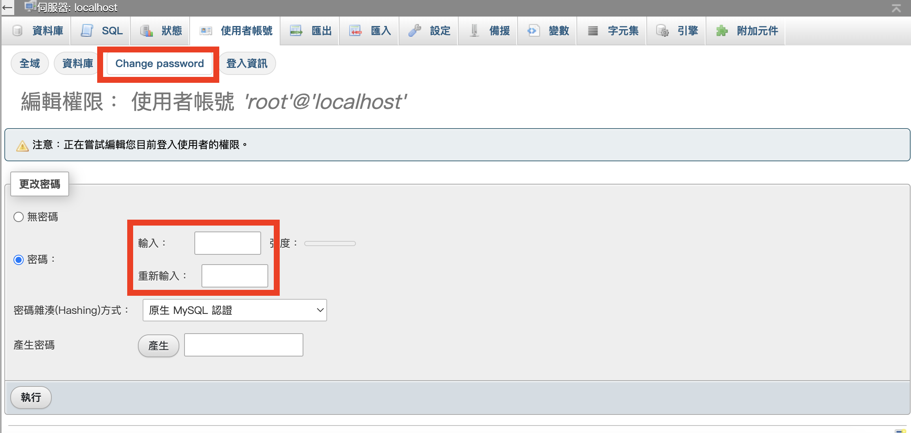

    - 修改完成後，必須到 `config` 修改登入密碼
    - 開啟 `應用程式` 資料夾
    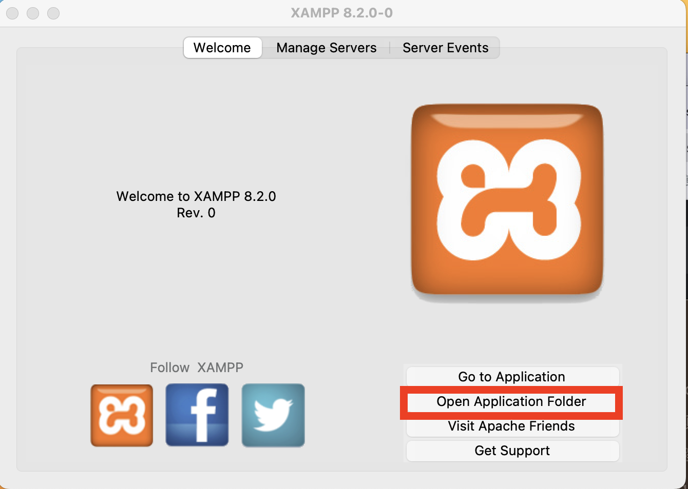

    - 找到 `xamppfiles / phpmyadmin / config.inc.php`
    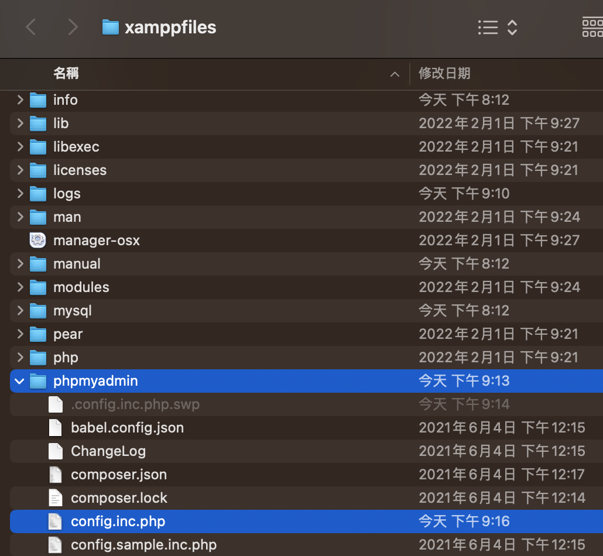

    - 編輯 `config.inc.php`，更改為 剛剛設定的新密碼，並儲存後關閉
    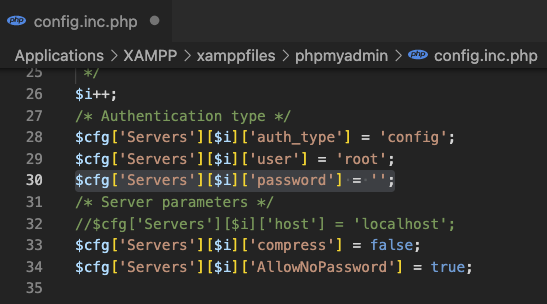

    - 重新 啟動 `phpMyAdmin`，即可以新密碼自動登入


## 0-2 建立學習用資料庫
  - ### 透過 SQL 語法來操作資料庫
    1. 建立資料庫
      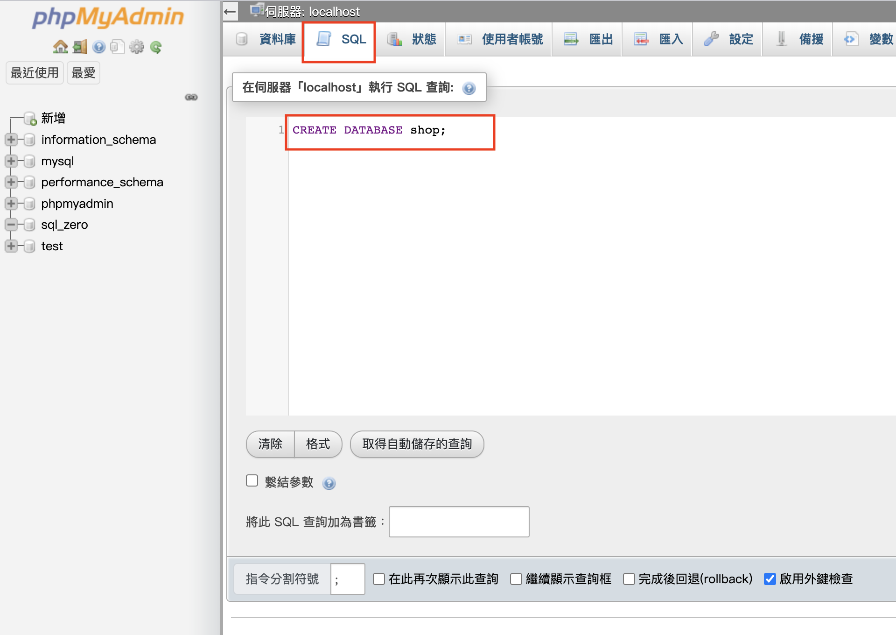
        - 進入 `操作/編碼與排序`，將編碼改為 `utf8mb4_unicode_ci`
          ::: warning 編碼與排序
          - `編碼`指的是文字的編碼方式，`排序`指的是字元資料的排序方式，這兩個設定關係到要儲存的文字。
          - 若不小心使用到別的編碼，之後才更改，會影響到原本儲存的資料產生亂碼。
          - 所以建議在建立資料前，先選擇好編碼與排序方式。
          :::
          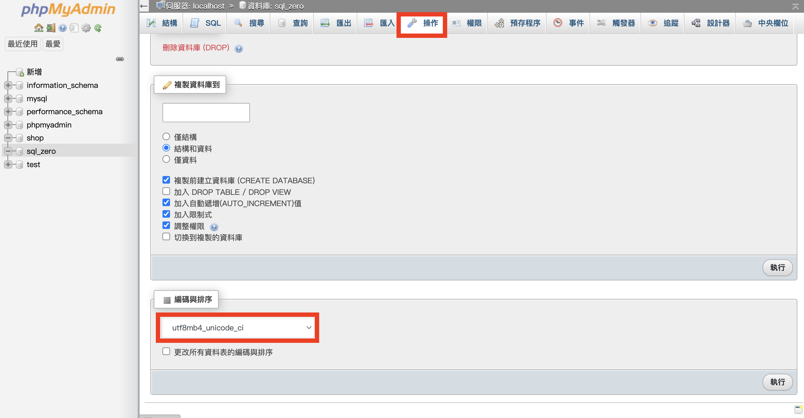

    2. 建立資料表
      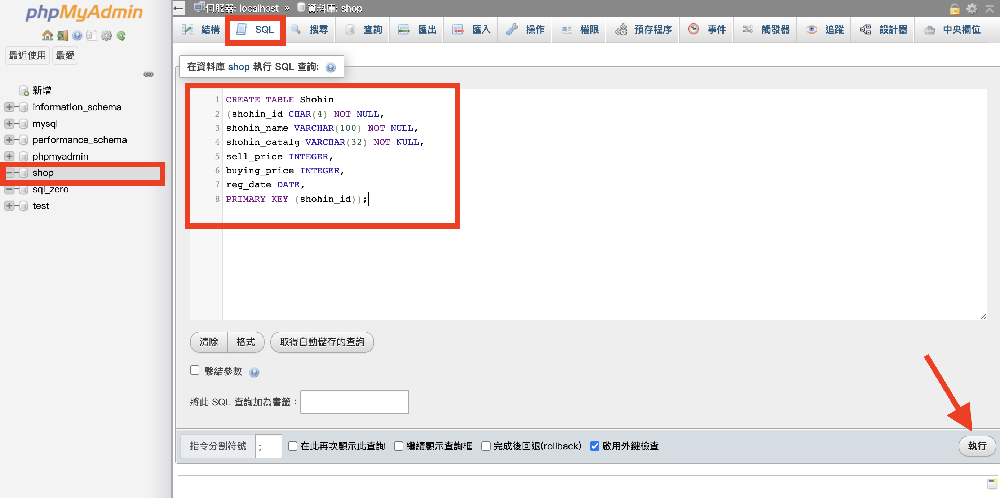
        ::: details 程式碼
        ```SQL
        CREATE TABLE Shohin
        (shohin_id CHAR(4) NOT NULL,
        shohin_name VARCHAR(100) NOT NULL,
        shohin_catalg VARCHAR(32) NOT NULL,
        sell_price INTEGER,
        buying_price INTEGER,
        reg_date DATE,
        PRIMARY KEY (shohin_id));
        ```
        :::
        - 建立成功
        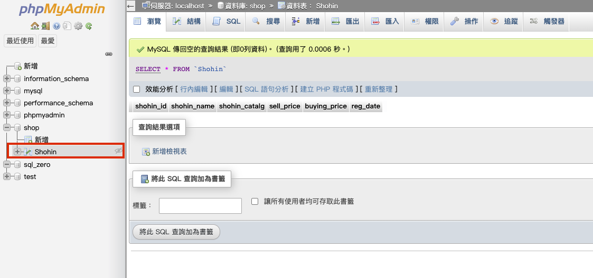

    3. 新增資料
      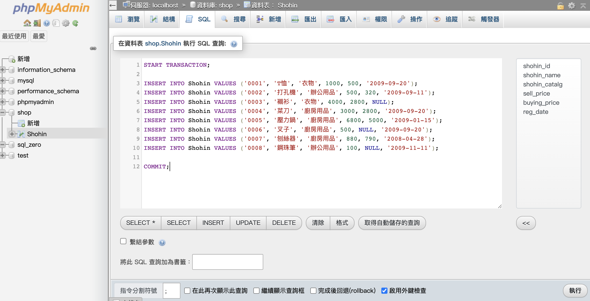
        ::: details 程式碼
        ```SQL
        START TRANSACTION;

        INSERT INTO Shohin VALUES ('0001', 'T恤', '衣物', 1000, 500, '2009-09-20');
        INSERT INTO Shohin VALUES ('0002', '打孔機', '辦公用品', 500, 320, '2009-09-11');
        INSERT INTO Shohin VALUES ('0003', '襯衫', '衣物', 4000, 2800, NULL);
        INSERT INTO Shohin VALUES ('0004', '菜刀', '廚房用品', 3000, 2800, '2009-09-20');
        INSERT INTO Shohin VALUES ('0005', '壓力鍋', '廚房用品', 6800, 5000, '2009-01-15');
        INSERT INTO Shohin VALUES ('0006', '叉子', '廚房用品', 500, NULL, '2009-09-20');
        INSERT INTO Shohin VALUES ('0007', '刨絲器', '廚房用品', 880, 790, '2008-04-28');
        INSERT INTO Shohin VALUES ('0008', '鋼珠筆', '辦公用品', 100, NULL, '2009-11-11');

        COMMIT;
        ```
        :::

        - 新增成功
        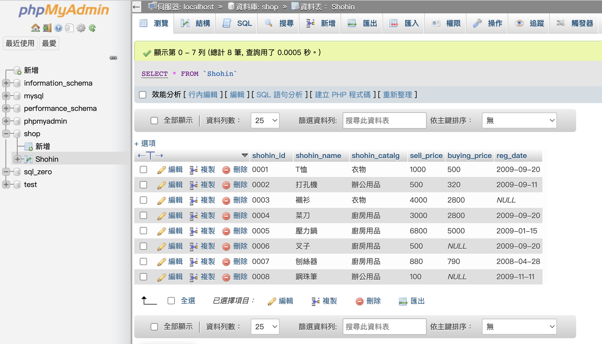
