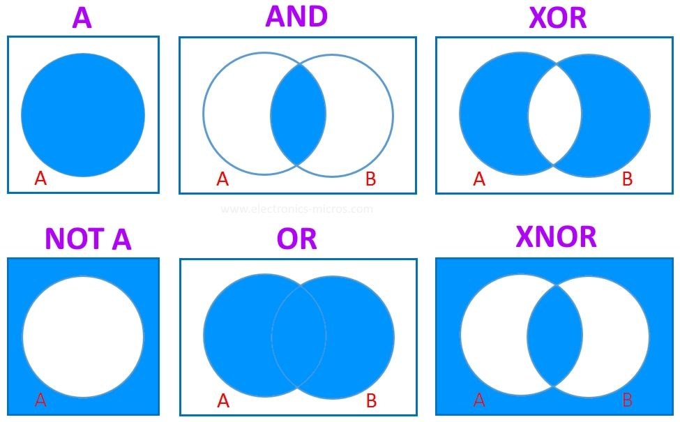

# 第 2 章 查詢的基本語法
## 2-1 SELECT 敘述的基本語法
  ::: info 學習重點
  - 從資料表篩選出資料需要使用 `SELECT 敘述`。
  - 欄位名稱可以改為顯示用的別名。
  - SELECT 子句部分可以寫入常數或運算式。
  - 若加上 `DISTINCT 關鍵字`，便能省略重複的紀錄。
  - SQL 敘述之間可以寫入提示用的「註解」。
  - 藉由 `WHERE 子句` 可以從資料表篩選出符合查詢條件的紀錄。
  :::

### 輸出特定欄位資料
  從資料表取出資料，需要使用 `SELECT 敘述`，又稱為「 `查詢 (Query)` 」

  ::: warning 語法 2-1
  基本的 SELECT 敘述語法
  ```SQL
  SELECT <欄位名稱>, ...
  FROM <資料表名稱>;
  ```
  :::
  > - 此 SELECT 敘述，可以分為 `SELECT` 和 `FROM` 2段 「 `子句` 」。
  > - `子句` 是完整SQL敘述的構成元素。
  > - `SELECT` 子句後方，依序寫著想從資料輸出的 `欄位名稱`。
  > - `FROM` 子句後方，為 資料來源的 `資料表名稱`。

  ::: warning 範例 2-1
  輸出 Shohin 資料表的3個欄位
  ```SQL
  SELECT shohin_id, shohin_name, buying_price
  FROM Shohin;
  ```

  執行結果
  |shohin_id|shohin_name|buying_price|
  |---------|-----------|------------|
  |0001     |T恤        |500         |
  |0002     |打孔機      |320         |
  |0003     |襯衫        |2800        |
  |0004     |菜刀        |2800        |
  |0005     |壓力鍋      |5000        |
  |0006     |叉子        |            |
  |0007     |刨絲器      |790         |
  |0008     |鋼珠筆      |            |
  :::

  > - 當一次輸出多個欄位時，需要以`逗號(,)`隔開各個欄位名稱，
  > - 執行結果的各個欄位會按照 `SELECT 子句` 的順序排列。

### 輸出所有欄位資料
  想輸出資料表所有欄位的資料時，可以在 SELECT 子句後方使用代表所有欄位的 `星號` (*)。
  ::: warning 語法 2-2
  輸出所有欄位資料
  ```SQL
  SELECT *
  FROM <資料表名稱>;
  ```
  :::

  ::: warning 範例 2-2
  輸出 Shohin 資料表的所有欄位資料
  ```SQL
  SELECT *
  FROM Shohin;
  ```
  :::
  
  這段敘述和 範例2-2 會獲得相同的結果
  ::: warning 範例 2-3
  和 範例2-2 意義相同的 SELECT 敘述
  ```SQL
  SELECT shohin_id, shohin_name, shohin_catalg, sell_price, buying_price, reg_date
  FROM Shohin;
  ```
  :::

  ::: warning 執行結果
  |shohin_id|shohin_name|shohin_catalg|sell_price|buying_price|reg_date|
  |---------|-----------|-------------|----------|------------|----------|
  |0001     |T恤        |衣物          |1000      |500         |2009-09-20|
  |0002     |打孔機      |辦公用品      |500        |320         |2009-09-11|
  |0003     |襯衫        |衣物         |4000       |2800        |          |
  |0004     |菜刀        |廚房用品      |3000      |2800        |2009-09-20|
  |0005     |壓力鍋      |廚房用品      |6800       |5000        |2009-01-15|
  |0006     |叉子        |廚房用品      |500        |           |2009-09-20|
  |0007     |刨絲器      |廚房用品      |880        |790        |2008-04-28|
  |0008     |鋼珠筆      |辦公用品      |100        |            |2009-11-11|
  :::

  ::: tip 牢記的原則 2-1
  - `星號` (*) 指的是所有欄位。
  :::

  不過，若使用星號將無法指定執行結果的欄位排列順序，會以 `CREATE TABLE` 敘述所設定的順序來排列欄位。

> ### COLUMN - 任意換行容易發生錯誤
>  SQL 敘述允許使用換行或半形空白來區隔各個單字。
>
>  ```SQL
>  SELECT
>  *
>  FROM
>  Shohin
>  ;
>  ```
>
>  原則上請採用『 每段子句寫成一行 』的方式，
>  另外，像下面夾雜著空行的 SQL 敘述將無法正常執行。
>  ```SQL
>  SELECT *
>  --- ( 夾雜空行 ) ---
>  FROM Shohin;
>  ```

### 替欄位取個別名
  在 SQL 敘述中使用 `AS關鍵字`，便能替欄位另外取個 `別名`。

  ::: warning 範例 2-4
  替欄位取別名
  ```SQL
  SELECT  shohin_id     AS id,
          shohin_name   AS name,
          buying_price  AS bprice
  FROM Shohin;
  ```

  執行結果
  |id    |name    |bprice|
  |------|--------|------|
  |0001  |T恤     |500   |
  |0002  |打孔機   |320   |
  |0003  |襯衫     |2800  |
  |0004  |菜刀     |2800  |
  |0005  |壓力鍋   |5000  |
  |0006  |叉子     |      |
  |0007  |刨絲器   |790   |
  |0008  |鋼珠筆   |      |
  :::

  欄位的別名亦可使用中文，這個時候需要以 `雙引號 (")` 將中文別名圍起來，而且不能使用 單引號(')。
  ::: warning 範例 2-5
  替欄位取別名
  ```SQL
  SELECT  shohin_id     AS "商品ID",
          shohin_name   AS "商品名稱",
          buying_price  AS "購入單價"
  FROM Shohin;
  ```

  執行結果
  |商品ID |商品名稱 |購入單價|
  |------|--------|------|
  |0001  |T恤     |500   |
  |0002  |打孔機   |320   |
  |0003  |襯衫     |2800  |
  |0004  |菜刀     |2800  |
  |0005  |壓力鍋   |5000  |
  |0006  |叉子     |      |
  |0007  |刨絲器   |790   |
  |0008  |鋼珠筆   |      |
  :::

  ::: tip 牢記的原則 2-2
  - 替欄位取中文別名的時候，需要以雙引號 (")圍住。
  :::

### 輸出常數
  SELECT 子句除了欄位名稱之外，也能寫入固定的文字或數值等常數。

  ::: warning 範例 2-6
  輸出常數
  ```SQL
  SELECT '商品' AS string, 38 AS number, '2009-02-24' AS s_date, shohin_id, shohin_name
  FROM Shohin;
  ```

  執行結果
  |string|number|s_date    |shohin_id|shohin_name|
  |------|------|----------|---------|-----------|
  |商品   |38    |2009-02-24|0001     |T恤        |
  |商品   |38    |2009-02-24|0002     |打孔機      |
  |商品   |38    |2009-02-24|0003     |襯衫        |
  |商品   |38    |2009-02-24|0004     |菜刀        |
  |商品   |38    |2009-02-24|0005     |壓力鍋      |
  |商品   |38    |2009-02-24|0006     |叉子        |
  |商品   |38    |2009-02-24|0007     |刨絲器      |
  |商品   |38    |2009-02-24|0008     |鋼珠筆      |
  :::

  此外，SELECT 子句 中除了常數之外，還能寫入 `數學計算式`。

### 省略結果中重複的紀錄
  ::: warning 範例 2-7
  使用 DISTINCT 省略 shohin_catalg 欄位的重複資料
  ```SQL
  SELECT DISTINCT shohin_catalg
  FROM Shohin;
  ```

  執行結果
  |shohin_catalg|
  |-------------|
  |衣物         |
  |辦公用品      |
  |廚房用品      |
  :::

  ::: tip 牢記的原則 2-3
  - 想省略結果中的重複紀錄時，請在 SELECT 子句加上 DISTINCT。
  :::

  使用 DISTINCT 的時候，`NULL` 也會被當成 1 項資料，如果有多筆紀錄同為 `NULL`，也會被彙整成 1 項 `NULL`。

  ::: warning 範例 2-8
  對含有 NULL 的欄位使用 DISTINCT 關鍵字
  ```SQL
  SELECT DISTINCT buying_price
  FROM Shohin;
  ```

  執行結果
  |buying_price|
  |------------|
  |5000        |
  |            |
  |790         |
  |500         |
  |2800        |
  |320         |
  :::

  也可寫在多個欄位前面，多個欄位的資料會被視為一體，只有完全相同的資料才會進行彙整。
  ::: warning 範例 2-9
  在多個欄位前面加上 DISTINCT
  ```SQL
  SELECT DISTINCT shohin_catalg, reg_date
  FROM Shohin;
  ```

  執行結果
  |shohin_catalg|reg_date  |
  |-------------|----------|
  |衣物          |2009-09-20|
  |辦公用品      |2009-09-11|
  |辦公用品      |2009-11-11|
  |衣物         |          |
  |廚房用品      |2009-09-20|
  |廚房用品      |2009-01-15|
  |廚房用品      |2008-04-28|
  
  :::

  `DISTINCT` 關鍵字只能寫在 第 1 個欄位名稱的前面。

### 以 WHERE 子句篩選特定紀錄
  SELECT 敘述可以使用 `WHERE 子句` 來指定條件、篩選出想要的紀錄。

  ::: warning 語法 2-3
  SELECT 敘述的 WHERE 子句
  ```SQL
  SELECT <欄位名稱>, ...
  FROM <資料表名稱>
  WHERE <條件式>;
  ```
  :::

  ::: warning 範例 2-10
  選擇 shohin_catalg 欄位為 '衣物' 的紀錄
  ```SQL
  SELECT shohin_name, shohin_catalg
  FROM Shohin
  WHERE shohin_catalg = '衣物';
  ```

  執行結果
  |shohin_name|shohin_catalg|
  |-----------|-------------|
  |T恤        |衣物          |
  |襯衫        |衣物         |
  :::

  WHERE 子句會先篩選出符合條件的紀錄，然後按照 SELECT 子句所指定的欄位輸出資料。
  
  ::: warning 範例 2-11
  可以不輸出做為搜尋條件的欄位
  ```SQL
  SELECT shohin_name
  FROM Shohin
  WHERE shohin_catalg = '衣物';
  ```

  執行結果
  |shohin_name|
  |-----------|
  |T恤        |
  |襯衫        |
  :::

  ::: tip 牢記的原則 2-4
  - WHERE 子句 必須放在 FORM 子句的後方。
  :::

### 註解的寫法
  - #### 單行註解
    寫在「 `--` 」的後方， 1 則註解只能寫成 1 行。

    ::: warning 範例 2-13
    單行註解的使用實例
    ```SQL
    -- 此 SELECT 敘述會移除結果中相同的紀錄
    SELECT DISTINCT shohin_id, buying_price
    FROM Shohin;
    ```
    :::

  - #### 多行註解
    寫在「 `/*` 」和「 `*/` 」的範圍中，可以跨越多行。
    ::: warning 範例 2-13
    單行註解的使用實例
    ```SQL
    /* 此 SELECT 敘述
      會移除結果中相同的紀錄 */
    SELECT DISTINCT shohin_id, buying_price
    FROM Shohin;
    ```
    :::

  ::: tip 牢記的原則 2-5
  - 註解是某段 SQL 敘述的說明或注意事項等解說文字。
  - 有 **單行註解** 和 **多行註解** 等 2 種寫法。
  :::

## 2-2 算術運算子與比較運算子
  ::: info 學習重點
  - 以左右 2 則的欄位或資料數值執行運算 (計算或比較等動作) 的符號稱為「`運算子`」。
  - 使用算術運算子可以執行 `四則運算`。
  - 加上`括號()` 可以提升此部分運算的優先順序 (先進行運算)。
  - 如果運算的對象包括 `NULL`，其結果必為 `NULL`。
  - 透過比較運算子的功能，可以得知欄位或資料數值之間的相等、不相等、大於、以及小於...等關係。
  - 想確認是否為 NULL 時，請使用 `IS NULL` 運算子或 `IS NOT NULL` 運算子。
  :::

### 算術運算子
  SQL 敘述當中也可以寫入數學計算式。

  ::: warning 範例 2-17
  SQL 敘述中也能寫入計算式
  ```SQL
  SELECT shohin_name, shohin_price,
    sell_price * 2 AS "sell_price_x2"
  FROM Shohin
  ```

  執行結果
  |shohin_name|sell_price|sell_price_x2|
  |-----------|----------|-------------|
  |T恤        |1000      |2000         |
  |打孔機      |500       |1000         |
  |襯衫        |4000      |8000         |
  |菜刀        |3000      |6000         |
  |壓力鍋      |6800      |13600        |
  |叉子        |500       |1000         |
  |刨絲器      |880       |1760         |
  |鋼珠筆      |100       |200          |
  :::

  這樣的計算動作，會對每行紀錄逐行執行。
  
  SQL 敘述中，主要可使用的四則運算符號：
  |意義   |符號|
  |-------|---|
  |加法運算|+  |
  |減法運算|-  |
  |乘法運算|*  |
  |除法運算|/  |

  這裡用來執行四則運算的符號 (`+`、`-`、`*`、`/`) ，被稱為 `算術運算子`。

  `運算子` 符號能運用左右 2 側的數值資料，完成四則運算、連結字串、以及比較數值的大小等運算工作，最後回傳運算結果。

  ::: tip 牢記的原則 2-6
  - SELECT 子句中，可以寫入常數或運算式。
  :::

  SQL 敘述和一般的計算式同樣可以使用 `括號()`。計算式中被括號()圍住的部分，其優先順序較高、會先進行計算。

### 請留意 NULL 的運算
  包含 `NULL` 的計算，其結果必然會是 `NULL`。

> ### COLUMN - FROM 子句是必要的嗎？
>   ::: warning 範例 2-A
>   只有 SELECT 子句的 SELECT 敘述
>   ```SQL
>   SELECT (100 + 200) + 3 AS count_all;
>   ```
>
>    執行結果
>    |count_all|
>    |---------|
>    |900      |
>   :::
>
>  不過有些 RDBMS 不允許沒有 FROM 子句的 SELECT 敘述，`Oracle` 便是其中之一。
>
>  `Oracle` 必須有 FROM 子句，遇到類似的需求時，可以指定名為 `DUAL` 的虛擬資料表。
>
>  另外，`DB2` 可以指定 `SYSTEM.SYSDUMMY1` 名稱的資料表。

### 比較運算子
  ::: warning 範例 2-18
  篩選出 sell_price 欄位為 500 的紀錄
  ```SQL
  SELECT shohin_name, shohin_catalg
  FROM Shohin
  WHERE sell_price = 500;
  ```

  執行結果
  |shohin_name|shohin_catalg|
  |-----------|-------------|
  |打孔機      |辦公用品      |
  |叉子        |廚房用品      |
  :::

  像 `=` 符號這樣可以比較 2 側的欄位或數值的符號稱為 `比較運算子`，而比較運算子「 `=` 」的功用，便是用來比較 2 側是否相等。

  > 雖然也有很多 RDBMS 可以使用比較運算子 「 `!=` 」來表達不相等的意思，不過這並非標準 SQL 所認可的運算子，建議避免使用。

  使用比較運算子 「 `<>` 」來表達「 `不相等` 」的否定條件。

  ::: warning 範例 2-19
  篩選出 sell_price 欄位不是 500 的紀錄
  ```SQL
  SELECT shohin_name, shohin_catalg
  FROM Shohin
  WHERE sell_price <> 500;
  ```

  執行結果
  |shohin_name|shohin_catalg|
  |-----------|-------------|
  |T恤        |衣物          |
  |襯衫        |衣物         |
  |菜刀        |廚房用品      |
  |壓力鍋      |廚房用品      |
  |刨絲器      |廚房用品      |
  |鋼珠筆      |辦公用品      |
  :::

  SQL 主要的比較運算子：
  |運算子|意義     |
  |-----|--------|
  |=    |和～相等 |
  |<>   |和～不相等|
  |>=   |大於或等於|
  |>    |大於～   |
  |<=   |小於或等於|
  |<    |小於～   |


  這些比較運算子可以針對文字、數值或日期等，幾乎所有資料型別的欄位或數值資料，執行比較的動作。

  ::: warning 範例 2-20
  篩選出販售單價大於或等於 1000 的紀錄
  ```SQL
  SELECT shohin_name, shohin_catalg, sell_price
  FROM Shohin
  WHERE sell_price >= 1000;
  ```

  執行結果
  |shohin_name|shohin_catalg|sell_price|
  |-----------|-------------|----------|
  |T恤        |衣物          |1000      |
  |襯衫        |衣物         |4000      |
  |菜刀        |廚房用品      |3000      |
  |壓力鍋      |廚房用品      |6800      |
  :::

  ::: warning 範例 2-21
  篩選出登錄日期早於 2009 年 9 月 27 日的紀錄
  ```SQL
  SELECT shohin_name, shohin_catalg, reg_date
  FROM Shohin
  WHERE reg_date < '2009-09-27';
  ```

  執行結果
  |shohin_name|shohin_catalg|reg_date  |
  |-----------|-------------|----------|
  |T恤        |衣物          |2009-09-20|
  |打孔機      |辦公用品      |2009-09-11|
  |菜刀        |廚房用品      |2009-09-20|
  |壓力鍋      |廚房用品      |2009-01-15|
  |叉子        |廚房用品      |2009-09-20|
  |刨絲器      |廚房用品      |2008-04-28|
  :::

  ::: tip 牢記的原則 2-7
  - 使用比較運算子時，必須注意不等號和等號的位置。
  :::

  也可以使用比較運算子來比較某個計算式的結果。

  ::: warning 範例 2-22
  WHERE 子句的條件式中亦可寫入計算式
  ```SQL
  SELECT shohin_name, shohin_price, buying_price
  FROM Shohin
  WHERE sell_price - buying_price >= 500;
  ```

  執行結果
  |shohin_name|sell_price|buying_price|
  |-----------|----------|------------|
  |T恤        |1000      |500         |
  |襯衫        |4000      |2800        |
  |壓力鍋      |6800      |5000        |
  :::

### 對字串使用不等號的需注意事項
  ::: warning 範例 2-23
  建立 Chars 資料表與存入資料
  ```SQL
  -- DDL：建立資料表
  CREATE TABLE Chars
  (chr CHAR(3) NOT NULL,
  PRIMARY KEY (chr));
  ```
  
  專用語法：`MaraDB`、`MySQL`
  ```SQL
  -- DML：存入資料
  START TRANSACTION;
  INSERT INTO Chars VALUES('1');
  INSERT INTO Chars VALUES('2');
  INSERT INTO Chars VALUES('3');
  INSERT INTO Chars VALUES('10');
  INSERT INTO Chars VALUES('11');
  INSERT INTO Chars VALUES('222');
  COMMIT
  ```
  :::

  ::: warning 專用語法：`SQL Server`、`PostgreSQL`、`Oracle`、`DB2`
  - `DML` 敘述在不同的 `DBMS` 上的寫法略有差異。
  - 在 `SQL Server` 和 `PostgreSQL` 上執行的時候，
  請將 `START TRANSACTION;` 換成 `BEGIN TRANSACTION;`

  - 而在 `Oracle` 和 `DB2` 上執行時，請刪除此行。
  :::

  ::: warning 範例 2-24
  篩選出大於 '2' 資料的 SELECT 敘述
  ```SQL
  SELECT chr
  FROM Chars
  WHERE chr > '2';
  ```

  執行結果
  |chr|
  |---|
  |3  |
  |222|
  :::

  應該要篩選出 `3、10、11、222` 4筆資料
  ，之所以會這樣，是因為不該把 數值和字串混為一談。

  由於建立 Chars 資料表的時候，chr 欄位被定義為 `字串型別`，之後比較當中的字串型別的資料時，便會使用和數值資料不同的規則。

  「 `字典排序 (Lexicographical / Dictionary Order)` 」是其中相當具有代表性的規則，如同它的名稱，字典排序會按照字典編排的方式來決定資料的順序。

  ::: tip 牢記的原則 2-8
  - 字串型別的順序為 `字典排序`，請勿和數值的大小順序搞混。
  :::

### 不能對 NULL 使用比較運算子
  ::: warning 範例 2-25
  篩選購入單價為 2800 元的紀錄
  ```SQL
  SELECT shohin_name, buying_price
  FROM Shohin
  WHERE buying_price = 2800;
  ```

  執行結果
  |shohin_name|buying_price|
  |-----------|------------|
  |襯衫        |2800        |
  |菜刀        |2800        |
  :::

  上面的結果看起來相當合理。再來試著篩選出購入單價不是 2800 元的紀錄。

  ::: warning 範例 2-26
  篩選購入單價不是 2800 元的紀錄
  ```SQL
  SELECT shohin_name, buying_price
  FROM Shohin
  WHERE buying_price <> 2800;
  ```

  執行結果
  |shohin_name|buying_price|
  |-----------|------------|
  |T恤        |500         |
  |打孔機      |320         |
  |壓力鍋      |5000        |
  |刨絲器      |790         |
  :::

  結果中，並沒有包含「叉子」和「鋼珠筆」的紀錄，由於這 2 項商品的購入單價原本就是不明的狀態 (`NULL`)，所以無法判斷其購入單價是否為2800。

  試著寫入「`buying_price = NULL`」，執行後也不會輸出任何紀錄。

  ::: warning 範例 2-27
  錯誤的 SELECT 敘述 (無法篩選出任何紀錄)
  ```SQL
  SELECT shohin_name, buying_price
  FROM Shohin
  WHERE buying_price = NULL;
  ```

  執行結果： (沒有任何紀錄)
  |shohin_name|buying_price|
  |-----------|------------|
  :::

  即使使用 `<>` 運算子，同樣無法篩選出欄位資料不為 `NULL` 的資料。

  想要篩選出某個欄位為 `NULL` 的紀錄時，請使用 `IS NULL` 運算子。

  ::: warning 範例 2-28
  篩選出欄位內容為 NULL 的紀錄
  ```SQL
  SELECT shohin_name, buying_price
  FROM Shohin
  WHERE buying_price IS NULL;
  ```

  執行結果：
  |shohin_name|buying_price|
  |-----------|------------|
  |叉子        |            |
  |鋼珠筆      |            |
  :::

  相反地，如果想篩選出某個欄位不為 `NULL` 的紀錄，可以使用 `IS NOT NULL` 運算子。

  ::: warning 範例 2-29
  篩選出不為 NULL 的紀錄
  ```SQL
  SELECT shohin_name, buying_price
  FROM Shohin
  WHERE buying_price IS NOT NULL;
  ```

  執行結果：
  | shohin_name | buying_price |
  |-------------|-------------:|
  | T恤         |          500 |
  | 打孔機      |          320 |
  | 襯衫        |         2800 |
  | 菜刀        |         2800 |
  | 壓力鍋      |         5000 |
  | 刨絲器      |          790 |
  :::

  ::: tip 牢記的原則 2-9
  - 想篩選出某個欄位為 `NULL` 的紀錄時，條件式中應該使用 `IS NULL` 運算子。
  - 而想篩選出不為 `NULL` 的紀錄時，則應該使用 `IS NOT NULL` 運算子。
  :::

## 2-3 邏輯運算子
  ::: info 學習重點
  - 運用 `邏輯運算子`，便可組合多個查詢條件來篩選資料。
  - `NOT 運算子`，可以寫出 「 不是～ 」的查詢條件。
  - `AND 運算子`，左右 2 側的條件均成立時，整段查詢條件才算成立。
  - `OR 運算子`，左右 2 側的條件只要有 1 側成立、或 2 側均成立時，整段查詢條件即為成立。
  - `真 (TURE)` 與 `偽 (FALSE)` 這 2 個值均屬於真偽值 (Truth Value)。比較運算子的比較結果成立時回傳 `真`、而不成立時，則回傳 `偽`，不過，SQL 還具有 `未知(UNKNOWN)` 這個獨特的真偽值。
  - 透過邏輯運算子執行的真偽值比較、以及比較結果的一覽表被稱為 `真偽表`。
  - SQL 的邏輯運算為包含了真、偽和未知的 3 值邏輯 (Three Value Logic) 運算。
  :::

### NOT 運算子
  `NOT` 運算子無法單獨存在，必須和其他查詢條件組合使用。

  ::: warning 範例 2-30
  篩選「 販售單價高於 1000 元 」的紀錄
  ```SQL
  SELECT shohin_name, shohin_catalg, sell_price
  FROM Shohin
  WHERE sell_price >= 1000;
  ```

  執行結果：
  |shohin_name|shohin_catalg|sell_price|
  |-----------|-------------|----------|
  |T恤        |衣物          |1000      |
  |襯衫        |衣物         |4000       |
  |菜刀        |廚房用品      |3000      |
  |壓力鍋      |廚房用品      |6800       |
  :::

  ::: warning 範例 2-31
  在 範例 2-30 的查詢條件加上 `NOT 運算子`
  ```SQL
  SELECT shohin_name, shohin_catalg, sell_price
  FROM Shohin
  WHERE NOT sell_price >= 1000;
  ```

  執行結果：
  |shohin_name|shohin_catalg|sell_price|
  |-----------|-------------|----------|
  |打孔機      |辦公用品      |500        |
  |叉子        |廚房用品      |500        |
  |刨絲器      |廚房用品      |880        |
  |鋼珠筆      |辦公用品      |100        |
  :::

  ::: warning 範例 2-32
  WHERE 子句的查詢條件和 範例 2-31 等價
  ```SQL
  SELECT shohin_name, shohin_catalg, sell_price
  FROM Shohin
  WHERE sell_price < 1000;
  ```

  執行結果：
  |shohin_name|shohin_catalg|sell_price|
  |-----------|-------------|----------|
  |打孔機      |辦公用品      |500        |
  |叉子        |廚房用品      |500        |
  |刨絲器      |廚房用品      |880        |
  |鋼珠筆      |辦公用品      |100        |
  :::

  ::: tip 牢記的原則 2-10
  - NOT 運算子能寫出否定的條件，不過請勿刻意使用，語意難懂。
  :::

### AND 運算子與 OR 運算子
  實務上常常會綜合使用多個查詢條件，篩選出真正需要的紀錄資料。

  在 WHERE子句 中，使用 `AND 運算子` 或 `OR 運算子`，即能組合使用多個查詢條件。

  - `AND 運算子` 的作用為「 當左右 2 側的查詢條件均成立時，整段查詢條件才算成立 」。
  - `OR 運算子` 的作用為「 當左右 2 側的查詢條件中，有 1 側、或 2 側均成立時，整段查詢條件即為成立 」。

  ::: warning 範例 2-33
  在 WHERE 子句的查詢條件使用 `AND 運算子`
  ```SQL
  SELECT shohin_name, buying_price
  FROM Shohin
  WHERE shohin_catalg = '廚房用品'
    AND sell_price >= 3000;
  ```

  執行結果：
  | shohin_name | buying_price |
  |-------------|-------------:|
  | 菜刀        |         2800 |
  | 壓力鍋      |         5000 |
  :::

  ::: warning 範例 2-34
  在 WHERE 子句的查詢條件使用 `OR 運算子`
  ```SQL
  SELECT shohin_name, buying_price
  FROM Shohin
  WHERE shohin_catalg = '廚房用品'
    OR sell_price >= 3000;
  ```

  執行結果：
  | shohin_name | buying_price |
  |-------------|-------------:|
  | 襯衫        |         2800 |
  | 菜刀        |         2800 |
  | 壓力鍋      |         5000 |
  | 叉子        |              |
  | 刨絲器      |          790 |
  :::

  ::: tip 牢記的原則 2-11
  - 組合多個查詢條件的時候，需要使用 `AND 運算子` 或 `OR 運算子`。
  :::

  ::: tip 牢記的原則 2-12
  - `范恩圖` 是相當方便的工具。
  
  :::

### 加上括號的部分優先處理
  若想查詢「 商品分類為辦公用品 」且 「登錄日期為 2009 年 9 月 11 日或 2009 年 9 月 20 日」
  ::: warning 範例 2-35
  將查詢條件直接寫成條件式
  ```SQL
  SELECT shohin_name, shohin_catalg, reg_date
  FROM Shohin
  WHERE shohin_catalg = '辦公用品'
    AND reg_date = '2009-09-11'
    OR reg_date = '2009-09-20';
  ```

  執行結果：
  |shohin_name|shohin_catalg|reg_date  |
  |-----------|-------------|----------|
  |T恤        |衣物          |2009-09-20|
  |打孔機      |辦公用品      |2009-09-11|
  |菜刀        |廚房用品      |2009-09-20|
  |叉子        |廚房用品      |2009-09-20|
  :::

  `AND 運算子` 的優先順序高於 `OR 運算子`。
  所以會被解讀成：
  > 「 shohin_catalg = '辦公用品' AND reg_date = '2009-09-11' 」
  > OR
  > 「 reg_date = '2009-09-20' 」

  而想讓 `OR 運算子` 的優先順序高於 `AND 運算子` 的時候，可以將 `OR 運算子` 以半形的 `括號()` 圍起來。

  ::: warning 範例 2-36
  加上括號讓 `OR 運算子` 優先於 `AND 運算子`
  ```SQL
  SELECT shohin_name, shohin_catalg, reg_date
  FROM Shohin
  WHERE shohin_catalg = '辦公用品'
    AND (reg_date = '2009-09-11'
    OR reg_date = '2009-09-20');
  ```

  執行結果：
  |shohin_name|shohin_catalg|reg_date  |
  |-----------|-------------|----------|
  |打孔機      |辦公用品      |2009-09-11|
  :::

  ::: tip 牢記的原則 2-13
  - `AND` 比 `OR` 優先，而想讓 `OR` 優先於 `AND` 的時候請加上括號。
  :::

### 邏輯運算子 與 真偽值
  `NOT`、`AND`、`OR` 等，被稱為 `邏輯運算子`。
  
  `邏輯運算` 指的是 「 操作`真偽值` 」。

  #### 真偽表
  - ##### AND
    |P |Q |P AND Q|
    |--|--|:-----:|
    |真|真 |真     |
    |真|F  |F     |
    |F |真 |F     |
    |F |F  |F     |

  - ##### OR
    |P |Q |P OR Q|
    |--|--|:-----:|
    |真|真 |真     |
    |真|F  |真     |
    |F |真 |真     |
    |F |F  |F     |

  - ##### NOT
    |P |NOT P|
    |--|:---:|
    |真|F     |
    |F |真    |

  - ##### P AND (Q OR R)
    |P |Q |R |Q OR R|P AND (Q OR R)|
    |--|--|--|------|:------------:|
    |真|真 |真|真    |真             |
    |真|真 |F |真    |真             |
    |真|F |真 |真    |真             |
    |真|F |F  |F    |F              |
    |F |真 |真|真    |F             |
    |F |真 |F |真    |F             |
    |F |F |真 |真    |F             |
    |F |F |F |F     |F             |

  ::: tip 牢記的原則 2-14
  - 複雜的條件整理成 `真偽表` 會比較容易理解。
  :::

### 含有 NULL 時的真偽值
  使用邏輯運算子的時候，也必須特別注意包含 `NULL` 的狀況。
  
  在邏輯運算中，`NULL` 既非為真也非偽，此時的真偽值被稱為 「 `未知 (UNKNOWN)` 」的第 3 值。

  3 值邏輯中 AND 和 OR 的真偽表：
  - ##### AND
    |P |Q |P AND Q|
    |--|--|:-----:|
    |真|真 |真     |
    |真|F  |F     |
    |真|未 |未     |
    |F |真 |F     |
    |F |F  |F     |
    |F |未 |未     |
    |未|真 |未     |
    |未|F  |F     |
    |未|未 |未     |
  - ##### OR
    |P |Q |P OR Q|
    |--|--|:-----:|
    |真|真 |真     |
    |真|F  |真     |
    |真|未 |真     |
    |F |真 |真     |
    |F |F  |F     |
    |F |未 |未     |
    |未|真 |真     |
    |未|F  |未     |
    |未|未 |未     |

> ### COLUMN - Shohin 資料表設定 NOT NULL 條件約束的理由
> 增加 `NULL` 的狀況，會讓條件判斷變得非常地複雜，而且是違反一般人直覺的做法，因此在資料庫領域的專家之間，便有「 盡量避免使用 `NULL` 」的共識。

## 自我練習
  - 2.1 請從 Shohin (商品) 資料表中，篩選出「 登錄日期 (reg_date) 晚於 2009 年 4 月 28 日 」的商品，而且需要輸出 shohin_name 和 reg_date 等 2 個欄位。
    ::: details 練習
    ```SQL
    SELECT shohin_name, reg_date
    FROM Shohin
    WHERE reg_date > '2009-04-28';f
    ```
    :::

  - 2.2 如果對 Shohin 資料表執行下列 3 段 SELECT 敘述，將會獲得什麼樣的結果呢？
    - ```SQL
      SELECT *
      FROM Shohin
      WHERE buying_price = NULL;
      ```

    - ```SQL
      SELECT *
      FROM Shohin
      WHERE buying_price <> NULL;
      ```
    
    - ```SQL
      SELECT *
      FROM Shohin
      WHERE buying_price > NULL;
      ```

    ::: details 練習
    3 段皆查無結果。
    :::

  - 2.3 範例 2-22 的 SELECT 敘述，能從 Shohin 資料表篩選出「 販售單價(sell_price) 比購入單價(buying_price) 多 500 元以上 」的商品，請另外寫出 "2段" 可以獲得相同結果的 SELECT 敘述，其結果應該如下所示。
    | shohin_name | sell_price | buying_price |
    |-------------|-----------:|-------------:|
    | T恤         |       1000 |          500 |
    | 襯衫        |       4000 |         2800 |
    | 壓力鍋      |       6800 |         5000 |

    ::: details 練習
    練習一
    ```SQL
    SELECT shohin_name, sell_price, buying_price
    FROM Shohin
    WHERE shohin_name = 'T恤'
      OR shohin_name = '襯衫'
      OR shohin_name = '壓力鍋';
    ```

    練習二
    ```SQL
    SELECT shohin_name, sell_price, buying_price
    FROM Shohin
    WHERE shohin_catalg = '衣物' OR shohin_catalg = '廚房用品' AND sell_price > 5000;
    ```
    :::

  - 2.4 請從 Shohin 資料表中篩選出「 即使將販售單價降低 10%，其利潤還是高於 100 元的辦公用品和廚房用品 」，而且需要輸出 shohin_name、shohin_catalg 以及販售單價降低 10% 後的利潤 (賦予 s_profit 的別名) 等 3 個欄位。
    ::: details 提示
    - 「 販售單價降低 10% 」，可將 sell_price 欄位乘上 0.9 求得，
    - 「 利潤 」可用該數值減去 buying_price 欄位求得。
    :::

    ::: details 練習
    練習一
    ```SQL
    SELECT shohin_name, shohin_catalg, (sell_price * 0.9) - buying_price AS s_profit
    FROM Shohin
    WHERE buying_price IS NOT NULL
      AND(sell_price * 0.9) - buying_price > 100;
    ```
    :::
